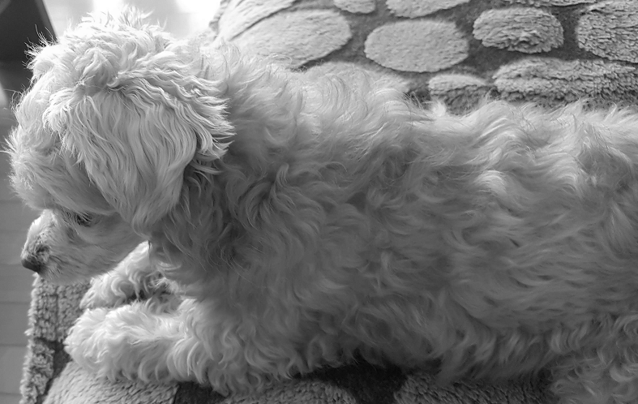
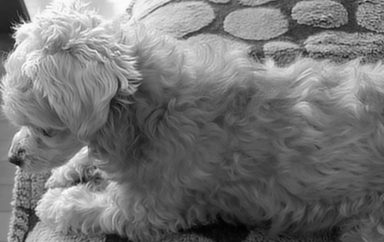
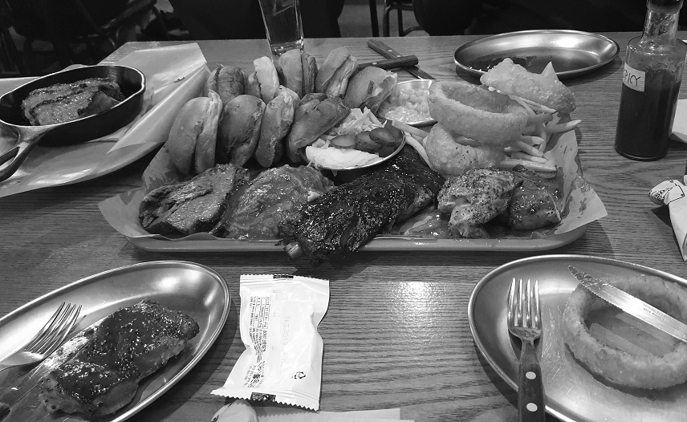
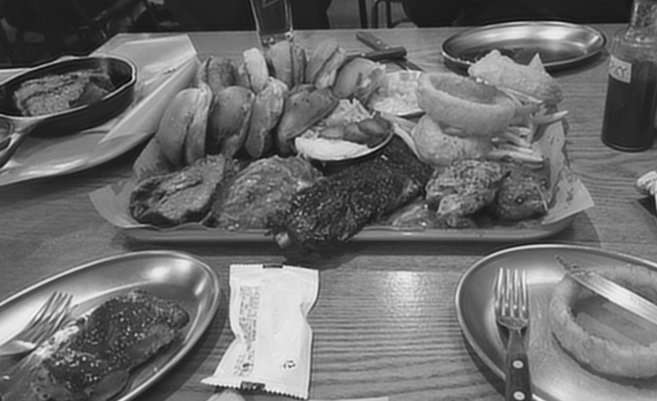

# SRCNN for Gaussian Blur

Restore blurred image by removing gaussian blur filter on image using SRCNN.

SRCNN is CNN for Super Resolution problem.

Originate from [SRCNN-Tensorflow](https://github.com/tegg89/SRCNN-Tensorflow)

## Prerequisites

Check out [requirements.txt](./requirements.txt)

- Tensorflow
- Scipy
- h5py
- matplotlib

### Install requirements

```bash
python3 -m venv .env
source ./env/bin/activate
pip3 install -r requirements.txt
```

## Results

### Example 1

Original



Gaussian-blurred image


Restored image



### Example 2

Original



Gaussian-blurred image


Original


